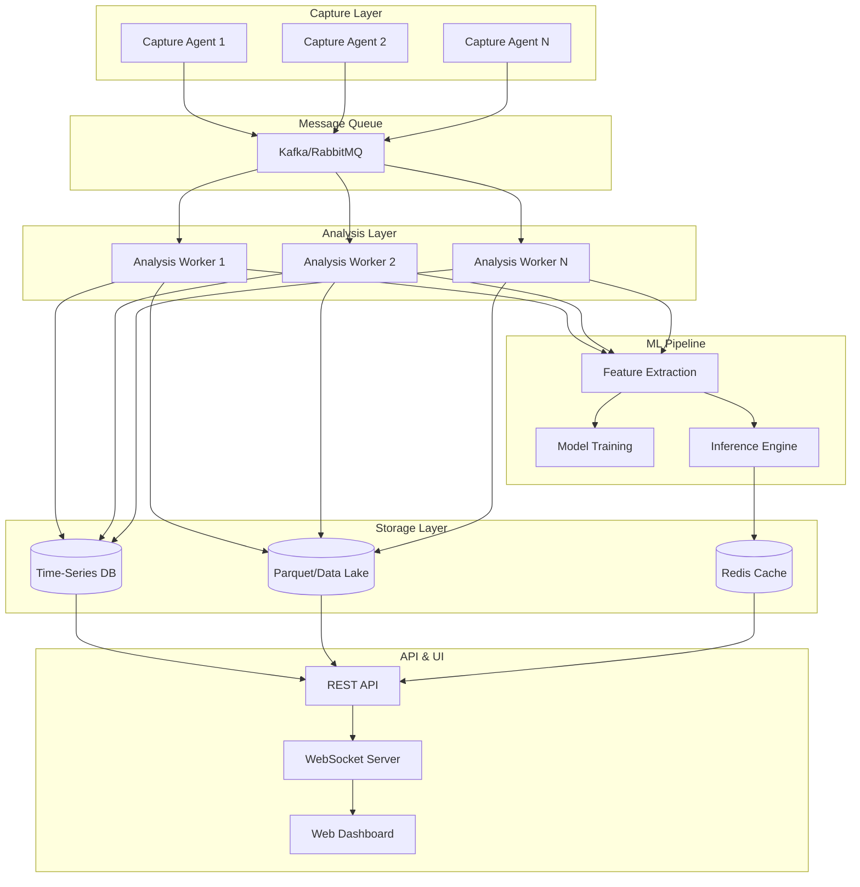

# NetGuard: Vision & Future Goals

## Project Vision

NetGuard aims to be a **comprehensive, enterprise-grade network security monitoring and analysis platform** that combines real-time packet capture, advanced protocol analysis, and machine learning-powered threat detection into a unified, production-ready system.

## Core Mission

To provide security operations teams, network administrators, and researchers with a powerful, scalable, and intelligent platform for:

1. **Real-time network threat detection and prevention**
2. **Automated security auditing and compliance monitoring**
3. **ML-driven anomaly detection and behavioral analysis**
4. **Comprehensive network traffic intelligence**

---

## Strategic Pillars

### 1. Enterprise-Level Network Monitoring

NetGuard will be a **production-ready monitoring solution** capable of:

- **Multi-interface packet capture** across distributed network segments
- **High-throughput processing** (targeting 10,000+ packets/second per node)
- **Real-time stream processing** with sub-second latency
- **Scalable architecture** supporting both single-node and distributed deployments
- **24/7 operation** with automatic recovery and failover mechanisms

### 2. ML-Powered Threat Intelligence

The platform will leverage **machine learning and advanced analytics** to:

- **Detect zero-day threats** through behavioral anomaly detection
- **Identify attack patterns** across multiple protocols (TCP, UDP, DNS, ICMP, ARP)
- **Predict security incidents** before they escalate
- **Classify traffic** with trained ML models for automatic threat categorization
- **Continuous learning** through online learning pipelines that adapt to network evolution
- **Threat hunting workflows** for proactive security operations

**Target Capabilities:**
- Port scanning detection (threshold-based and ML-based)
- DDoS attack identification (SYN floods, UDP floods, amplification attacks)
- DNS tunneling and exfiltration detection
- C2 communication pattern recognition
- Lateral movement detection
- ARP spoofing and MITM attack detection
- Protocol anomaly detection
- Behavioral profiling and deviation alerts

### 3. Comprehensive Protocol Analysis

NetGuard will provide **deep protocol-level intelligence** with specialized analyzers:

| Protocol | Analysis Depth | Key Capabilities |
|----------|---------------|------------------|
| **TCP** | Deep stateful analysis | Connection tracking, flag analysis, stream reconstruction, retransmission detection, handshake monitoring |
| **UDP** | Stateless analysis | Flow statistics, flood detection, amplification attack identification |
| **DNS** | Query/response analysis | Tunneling detection, DGA identification, query pattern analysis, response validation |
| **IP** | Network layer intelligence | Top talker identification, hub detection, fragmentation analysis, geolocation tracking |
| **Flow** | 5-tuple flow tracking | Session analysis, beaconing detection, long-lived connection monitoring |
| **ARP** | Address resolution monitoring | Spoofing detection, ARP table reconstruction, MITM detection |
| **ICMP** | ICMP analysis | Ping flood detection, tunneling identification, traceroute analysis |
| **Anomaly** | Cross-protocol correlation | Statistical anomaly detection, behavioral profiling, attack correlation |

### 4. Production-Ready REST API

A **FastAPI-based API** will provide programmatic access to all platform capabilities:

**Planned Endpoints:**
- `/api/capture/*` - Start/stop capture, configure interfaces, manage capture sessions
- `/api/analysis/*` - Trigger analysis workflows, retrieve results, schedule audits
- `/api/alerts/*` - Real-time alert management, severity filtering, alert acknowledgment
- `/api/reports/*` - Generate security reports, compliance audits, custom queries
- `/api/ml/*` - Model training, inference, feature extraction, model management
- `/api/packets/*` - Query captured packets, filter by criteria, export data
- `/api/flows/*` - Network flow analysis, session tracking, flow exports
- `/api/threats/*` - Threat intelligence feeds, IOC management, threat correlation

**API Features:**
- OAuth2/JWT authentication
- Role-based access control (RBAC)
- Rate limiting and throttling
- WebSocket support for real-time streaming
- OpenAPI/Swagger documentation
- API versioning
- Request validation and sanitization

### 5. Automated Security Operations

NetGuard will enable **autonomous security operations** through:

#### High-Level Workflows
- **Daily Security Audit**: Automated daily analysis with severity-based alerting
- **IP Investigation**: Deep-dive analysis of suspicious hosts
- **Threat Hunting**: Proactive hunting for APT indicators and advanced threats
- **Incident Response**: Automated triage and evidence collection
- **Compliance Reporting**: Automated generation of audit reports

#### Alert Management
- Real-time alert generation with configurable thresholds
- Severity classification (critical, high, medium, low, info)
- Alert deduplication and correlation
- Integration with SIEM platforms
- Automated response actions (blocking, logging, notification)

#### Reporting Engine
- Scheduled report generation
- Customizable report templates
- Multi-format exports (JSON, CSV, PDF, HTML)
- Visualization and dashboards
- Historical trend analysis

---

## Target Architecture

### Distributed Deployment Model

### Single-Node Deployment

For smaller deployments, NetGuard will support a unified single-node architecture with all components running on one system.

---

## Technology Stack (Target)

| Layer | Technology | Purpose |
|-------|-----------|---------|
| **Capture** | Scapy / libpcap | Packet capture and parsing |
| **Processing** | Polars / Apache Arrow | High-performance data processing |
| **Storage** | Parquet / TimescaleDB | Efficient columnar and time-series storage |
| **ML** | Scikit-learn / PyTorch | Model training and inference |
| **API** | FastAPI / WebSockets | REST API and real-time communication |
| **Cache** | Redis | Fast data caching and session management |
| **Queue** | Kafka / RabbitMQ | Distributed message processing |
| **Monitoring** | Prometheus / Grafana | System metrics and visualization |
| **UI** | React / D3.js | Interactive web dashboard |

---

## Key Features (Target State)

### Real-Time Capabilities
- ✅ Sub-second packet processing latency
- ✅ Live packet stream via WebSocket
- ✅ Real-time alert generation
- ✅ Streaming analytics with immediate threat detection
- ✅ Live dashboard updates

### ML & Analytics
- ✅ 8+ specialized protocol analyzers
- ✅ Automated feature engineering pipeline
- ✅ Pre-trained ML models for common threats
- ✅ Online learning for network-specific adaptation
- ✅ Behavioral profiling and baseline establishment
- ✅ Anomaly scoring and ranking

### Data Management
- ✅ Efficient Parquet-based storage (10x compression)
- ✅ Time-series database for metrics
- ✅ Data retention policies
- ✅ PII detection and masking
- ✅ Encryption at rest
- ✅ Automated data archival

### Usability
- ✅ Intuitive web dashboard
- ✅ Comprehensive REST API
- ✅ CLI tools for automation
- ✅ Workflow-based analysis (no coding required)
- ✅ Export to multiple formats (JSON, CSV, Parquet, PDF)
- ✅ Searchable packet archive

### Integration
- ✅ SIEM integration (Splunk, ELK, etc.)
- ✅ Threat intelligence feeds
- ✅ Webhook notifications
- ✅ Email/Slack alerts
- ✅ Custom plugin system

### Security & Compliance
- ✅ Role-based access control
- ✅ Audit logging
- ✅ Data encryption
- ✅ Compliance reporting (PCI-DSS, HIPAA, SOC 2)
- ✅ Secure credential management

---

## Use Cases

### 1. Enterprise Security Operations Center (SOC)
- Continuous network monitoring across multiple sites
- Automated threat detection and alerting
- Incident investigation and forensics
- Compliance reporting and auditing

### 2. Research & Development
- Network behavior analysis
- ML model training and evaluation
- Protocol research and analysis
- Security tool development

### 3. Managed Security Service Provider (MSSP)
- Multi-tenant monitoring
- Centralized analysis across customer networks
- Automated reporting and SLA tracking
- Custom threat detection rules per customer

### 4. Cloud Security
- Cloud network traffic analysis
- East-west traffic monitoring
- Container network security
- Serverless function monitoring

### 5. Industrial Control Systems (ICS/SCADA)
- OT network monitoring
- Protocol anomaly detection
- Unauthorized access detection
- Safety-critical alert management

---

## Success Metrics

NetGuard will be considered successful when it achieves:

1. **Detection Accuracy**
   - 95%+ true positive rate for known attacks
   - <5% false positive rate in production environments
   - Detection of zero-day threats through anomaly detection

2. **Performance**
   - Process 10,000+ packets/second per node
   - <100ms average analysis latency
   - Linear scalability with additional nodes

3. **Operational Excellence**
   - 99.9% uptime in production deployments
   - <1 hour mean time to detection (MTTD)
   - <15 minutes mean time to response (MTTR)

4. **Adoption**
   - Used in production by enterprise SOCs
   - Active community contributions
   - Published research using the platform

---

## Development Roadmap

### Phase 1: Foundation (Current)
- ✅ Core packet capture engine
- ✅ Protocol analyzers (8 analyzers)
- ✅ Parquet-based storage
- ✅ Configuration management
- ✅ Comprehensive documentation

### Phase 2: ML Integration (Next)
- 🔲 ML feature engineering pipeline
- 🔲 Model training framework
- 🔲 Inference engine
- 🔲 Pre-trained threat detection models
- 🔲 Online learning capabilities

### Phase 3: API & Integration
- 🔲 Complete REST API implementation
- 🔲 Authentication and authorization
- 🔲 WebSocket real-time streaming
- 🔲 SIEM integrations
- 🔲 Webhook notifications

### Phase 4: UI & Visualization
- 🔲 Web dashboard
- 🔲 Real-time packet visualization
- 🔲 Interactive threat timeline
- 🔲 Report builder
- 🔲 Alert management console

### Phase 5: Distribution & Scale
- 🔲 Distributed capture agents
- 🔲 Message queue integration
- 🔲 Horizontal scaling
- 🔲 Multi-site deployment
- 🔲 Load balancing

### Phase 6: Advanced Features
- 🔲 Threat intelligence integration
- 🔲 Automated response actions
- 🔲 Custom plugin system
- 🔲 Advanced ML models (deep learning)
- 🔲 Cloud-native deployment

---

## Competitive Positioning

NetGuard aims to differentiate itself by being:

1. **Open and Extensible**: Unlike proprietary solutions, fully customizable and extensible
2. **ML-First**: Native ML integration, not bolted on
3. **Performance-Optimized**: Modern tech stack (Polars, Parquet, FastAPI)
4. **Developer-Friendly**: Clean APIs, comprehensive docs, active community
5. **Cost-Effective**: Open-source alternative to expensive commercial solutions

**Target Comparison:**
- More accessible than Wireshark (automation, ML, API)
- More powerful than Zeek (Python ecosystem, ML models)
- More affordable than Darktrace (open-source, customizable)
- More focused than Splunk (purpose-built for network security)

---

## Long-Term Vision (3-5 Years)

NetGuard aspires to become:

1. **The de facto open-source network security platform** for enterprises and researchers
2. **A reference implementation** for ML-powered network security
3. **An ecosystem** with plugins, integrations, and community contributions
4. **A research platform** advancing the state of network threat detection
5. **A commercial offering** (optional managed service) while maintaining open-source core

---

## Principles & Philosophy

### Design Principles
- **Modular architecture**: Easy to extend and customize
- **Performance first**: Optimized for high-throughput, low-latency
- **Configuration over code**: YAML-based, no hard-coding
- **Security by design**: Defense in depth, least privilege
- **Observable**: Comprehensive logging and metrics

### Development Principles
- **Quality over speed**: Comprehensive testing, strict type checking
- **Documentation first**: Code is documented before it's written
- **Community-driven**: Open to contributions and feedback
- **Backwards compatible**: Stable APIs, migration paths
- **Production-ready**: Enterprise-grade reliability and support

---

## Success Criteria

NetGuard will be considered production-ready when:

- [ ] 80%+ test coverage across all modules
- [ ] Complete REST API with authentication
- [ ] At least 3 trained ML models deployed
- [ ] Web dashboard with core features
- [ ] Distributed deployment tested
- [ ] Security audit completed
- [ ] Performance benchmarks published
- [ ] User documentation complete
- [ ] Installation automated (Docker, packages)
- [ ] Active monitoring in production environment

---

## Conclusion

NetGuard is **not just a packet sniffer** or **not just an ML tool**—it is envisioned as a **complete, intelligent, enterprise-grade network security platform** that democratizes advanced threat detection capabilities, making them accessible to organizations of all sizes.

By combining real-time packet capture, sophisticated protocol analysis, machine learning-powered threat detection, and a production-ready API, NetGuard aims to be the platform that security teams reach for when they need comprehensive, automated, and intelligent network security monitoring.

**The goal**: Make network security monitoring smarter, faster, and more accessible to everyone.