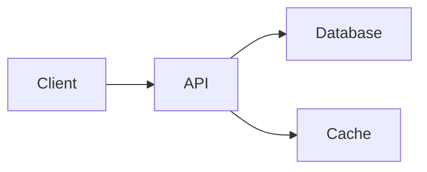

# AI Agent Guide: Professional README Creation for Portfolio Projects

**Purpose:** Use this guide to instruct AI agents to create professional, portfolio-ready README documentation for technical projects.

**Target Audience:** Recruiters, hiring managers, and technical evaluators

---

## Core Principles

1. **Honesty over perfection** - Clearly state project status (complete/incomplete/WIP)
2. **Show, don't just tell** - Include code examples, screenshots, and diagrams
3. **Technical depth with clarity** - Demonstrate expertise without jargon overload
4. **Visual hierarchy** - Use markdown effectively for scannable content
5. **Professional tone** - Direct, confident, informative (not academic or overly casual)

---

## README Structure Template

### Essential Sections (All Projects)
````markdown
# Project Name - Concise Descriptor

> Status Badge | Brief Hook (1 sentence explaining what problem this solves)

## Overview (2-3 paragraphs max)
- What the project does
- Why it exists/what problem it solves
- Key technologies used

## Features / What's Implemented ✅
- Bullet list of WORKING functionality
- Be specific with metrics when possible
- Use checkmarks for completed items

## Architecture / System Design
- High-level diagram (ASCII or image)
- Component breakdown
- Data flow explanation

## Technical Stack
- Languages with versions
- Frameworks and libraries
- Infrastructure/tools

## Quick Start / Installation
- Prerequisites
- Step-by-step setup
- Basic usage example

## Project Structure (for complex projects)
- Directory tree
- Brief explanation of key folders

## Technical Highlights / Interesting Decisions
- 2-4 points about non-obvious technical choices
- Why certain technologies were selected
- Problems solved elegantly

## Current Status & Roadmap
- What's done vs. what's planned
- Known limitations (if any)
- Future improvements

## Learning Outcomes / Context (optional)
- Skills demonstrated
- Evolution from initial concept
- Academic/professional context if relevant

## Gallery / Demo (if applicable)
- Screenshots
- GIFs of functionality
- Links to live demos
````

### Optional Sections (Use When Relevant)
````markdown
## Performance Metrics
## API Documentation
## Testing Strategy
## Contributing Guidelines
## License
## Acknowledgments
````

---

## Markdown Formatting Standards

### Headers
````markdown
# H1 - Project Title Only
## H2 - Major Sections
### H3 - Subsections
#### H4 - Rare, only for deep nesting
````

**Rule:** Never skip header levels (H1 → H3 without H2)

### Status Badges

Place at the top, use shields.io format:
````markdown


````

### Code Blocks

Always specify language for syntax highlighting:
````markdown
```python
# Good - language specified
def example():
    return "highlighted"
```
````
# Bad - no language
def example():
    return "not highlighted"
````
````

### Emphasis
````markdown
**Bold** - for KEY TERMS and important concepts
*Italic* - for emphasis or technical terms
`inline code` - for commands, variables, filenames
````

**Don't:** Use bold/italic excessively. Maximum 2-3 bold terms per paragraph.

### Lists
````markdown
# Unordered - for features, benefits, steps
- Item 1
- Item 2
  - Sub-item (2 spaces indent)

# Ordered - for sequential instructions
1. First step
2. Second step
3. Third step

# Task lists - for roadmaps/status
- [x] Completed task
- [ ] Pending task
````

### Links
````markdown
[Descriptive text](https://url.com) - inline links
[Demo Video](./docs/demo.gif) - relative paths for repo files

# Reference style for cleaner reading
See the [documentation][docs] for details.

[docs]: https://docs.example.com
````

### Tables

Use for comparisons, specifications:
````markdown
| Feature | Status | Notes |
|---------|--------|-------|
| API     | ✅     | REST endpoints |
| Auth    | 🚧     | In progress |
````

### Blockquotes
````markdown
> ⚠️ **Warning:** Use for important notes
> 💡 **Tip:** Use for helpful information
> 📌 **Note:** Use for additional context
````

### Horizontal Rules
````markdown
---
Use sparingly to separate major sections
---
````

---

## Architecture Diagrams

### ASCII Art (Always Works)
````markdown
# Simple flow
Source → Processor → Output

# Layered architecture
┌─────────────────┐
│   Frontend      │
├─────────────────┤
│   API Layer     │
├─────────────────┤
│   Database      │
└─────────────────┘

# Directional flow
┌──────────┐      ┌──────────┐      ┌──────────┐
│  Client  │─────►│  Server  │─────►│    DB    │
└──────────┘      └──────────┘      └──────────┘
````

### Tools for Visual Diagrams

1. **Mermaid** (GitHub renders automatically):
````markdown

````

2. **Excalidraw** → Export as PNG/SVG
3. **draw.io** → Export and commit to repo

**Storage:** Place diagrams in `/docs/images/` or `.github/assets/`

---

## Code Examples Best Practices

### DO
````markdown
## Installation
```bash
# Clone the repository
git clone https://github.com/user/project.git
cd project

# Install dependencies
pip install -r requirements.txt

# Run the application
python main.py
```

## Usage Example
```python
from project import Analyzer

# Initialize with configuration
analyzer = Analyzer(mode='realtime')

# Process data
results = analyzer.process(data_source)
print(f"Found {len(results)} anomalies")
```
````

### DON'T
````markdown
# Bad - vague pseudocode
````
analyzer.process()
result = get_results()
