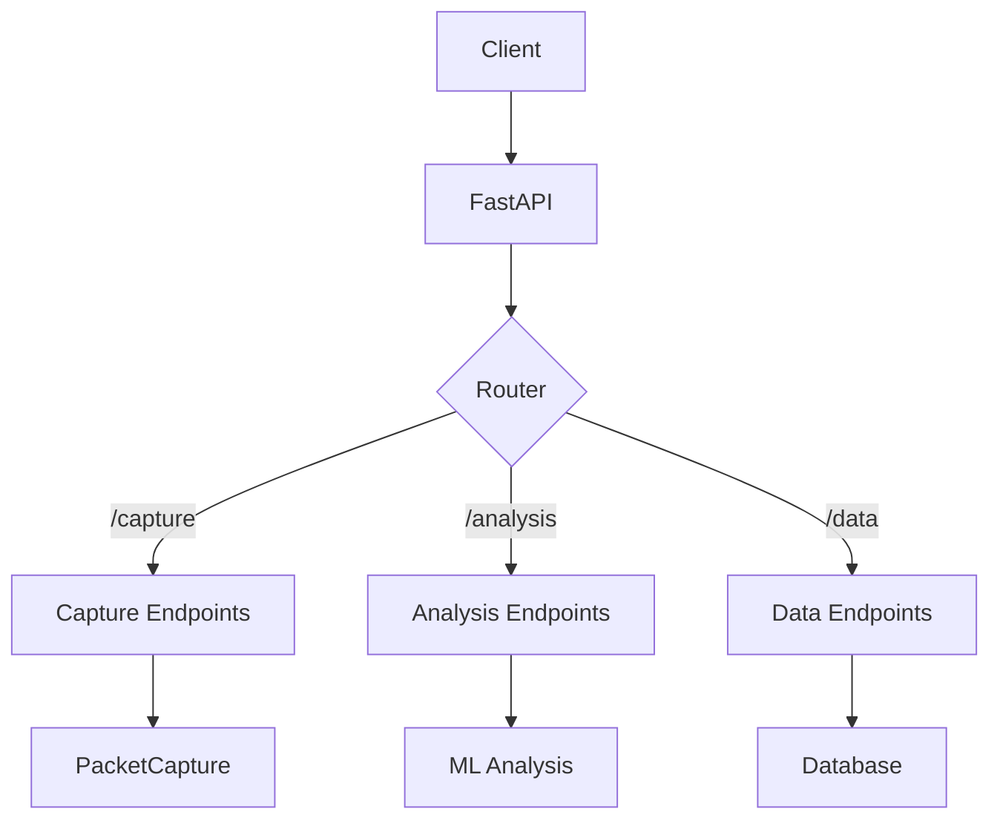

# API Module

The API module provides REST API endpoints for interacting with the Network Security Suite.

## Overview

The API module is built with FastAPI and provides programmatic access to network monitoring, packet capture, and analysis capabilities.

## Key Features

- **RESTful API**: Clean REST API design
- **OpenAPI Documentation**: Automatic API documentation
- **Authentication**: Secure API access
- **Real-time Updates**: WebSocket support for live data
- **JSON Responses**: Standard JSON response format

## Quick Start

### Starting the API Server

```bash
# Using uvicorn
uvicorn network_security_suite.api.main:app --reload

# Or with custom host/port
uvicorn network_security_suite.api.main:app --host 0.0.0.0 --port 8000
```

### API Documentation

Once the server is running, visit:
- **Swagger UI**: http://localhost:8000/docs
- **ReDoc**: http://localhost:8000/redoc
- **OpenAPI JSON**: http://localhost:8000/openapi.json

## Basic Usage

### Using Python Requests

```python
import requests

# Get system status
response = requests.get("http://localhost:8000/api/status")
status = response.json()
print(status)

# Start packet capture
capture_config = {
    "interface": "eth0",
    "packet_count": 1000,
    "filter": "tcp port 80"
}
response = requests.post("http://localhost:8000/api/capture/start", json=capture_config)
print(response.json())
```

### Using cURL

```bash
# Get status
curl http://localhost:8000/api/status

# Start capture
curl -X POST http://localhost:8000/api/capture/start \
  -H "Content-Type: application/json" \
  -d '{"interface": "eth0", "packet_count": 1000}'
```

## API Endpoints

### Status Endpoints

- `GET /api/status` - Get API status
- `GET /api/health` - Health check

### Capture Endpoints

- `POST /api/capture/start` - Start packet capture
- `POST /api/capture/stop` - Stop packet capture
- `GET /api/capture/status` - Get capture status
- `GET /api/capture/statistics` - Get capture statistics

### Analysis Endpoints

- `POST /api/analysis/run` - Run analysis on captured data
- `GET /api/analysis/results/{id}` - Get analysis results
- `GET /api/analysis/list` - List all analyses

### Data Endpoints

- `GET /api/packets` - Get captured packets
- `GET /api/packets/{id}` - Get specific packet
- `GET /api/flows` - Get network flows

## Architecture



## Authentication

### API Key Authentication

```python
import requests

headers = {
    "X-API-Key": "your-api-key-here"
}

response = requests.get(
    "http://localhost:8000/api/capture/status",
    headers=headers
)
```

### OAuth2 (Coming Soon)

OAuth2 authentication support is planned for future releases.

## WebSocket Support

### Real-time Packet Stream

```python
import asyncio
import websockets

async def packet_stream():
    uri = "ws://localhost:8000/ws/packets"
    async with websockets.connect(uri) as websocket:
        while True:
            packet = await websocket.recv()
            print(f"Received: {packet}")

asyncio.run(packet_stream())
```

### Real-time Alerts

```python
async def alert_stream():
    uri = "ws://localhost:8000/ws/alerts"
    async with websockets.connect(uri) as websocket:
        while True:
            alert = await websocket.recv()
            print(f"Alert: {alert}")
```

## Configuration

### API Configuration

```yaml
# config.yaml
api:
  host: "0.0.0.0"
  port: 8000
  debug: false
  reload: false

  cors:
    enabled: true
    origins:
      - "http://localhost:3000"
      - "http://localhost:8080"

  auth:
    enabled: true
    api_key_header: "X-API-Key"
    valid_api_keys:
      - "key1"
      - "key2"

  rate_limit:
    enabled: true
    requests_per_minute: 60
```

## Error Handling

### Standard Error Response

```json
{
  "error": {
    "code": "CAPTURE_FAILED",
    "message": "Failed to start packet capture",
    "details": {
      "interface": "eth0",
      "reason": "Permission denied"
    }
  }
}
```

### HTTP Status Codes

| Code | Description |
|------|-------------|
| 200 | Success |
| 201 | Created |
| 400 | Bad Request |
| 401 | Unauthorized |
| 403 | Forbidden |
| 404 | Not Found |
| 429 | Too Many Requests |
| 500 | Internal Server Error |

## Best Practices

### 1. Use API Keys

Always use API keys in production:

```python
headers = {"X-API-Key": os.getenv("API_KEY")}
response = requests.get(url, headers=headers)
```

### 2. Handle Errors

Always handle API errors:

```python
try:
    response = requests.post(url, json=data)
    response.raise_for_status()
    return response.json()
except requests.exceptions.HTTPError as e:
    logger.error(f"API error: {e}")
    return None
```

### 3. Use Pagination

For large result sets, use pagination:

```python
response = requests.get(
    "http://localhost:8000/api/packets",
    params={"limit": 100, "offset": 0}
)
```

## Next Steps

- [Getting Started Guide](getting-started.md): Step-by-step API tutorial
- [Endpoints Reference](endpoints.md): Complete endpoint documentation
- [Examples](examples.md): API usage examples
