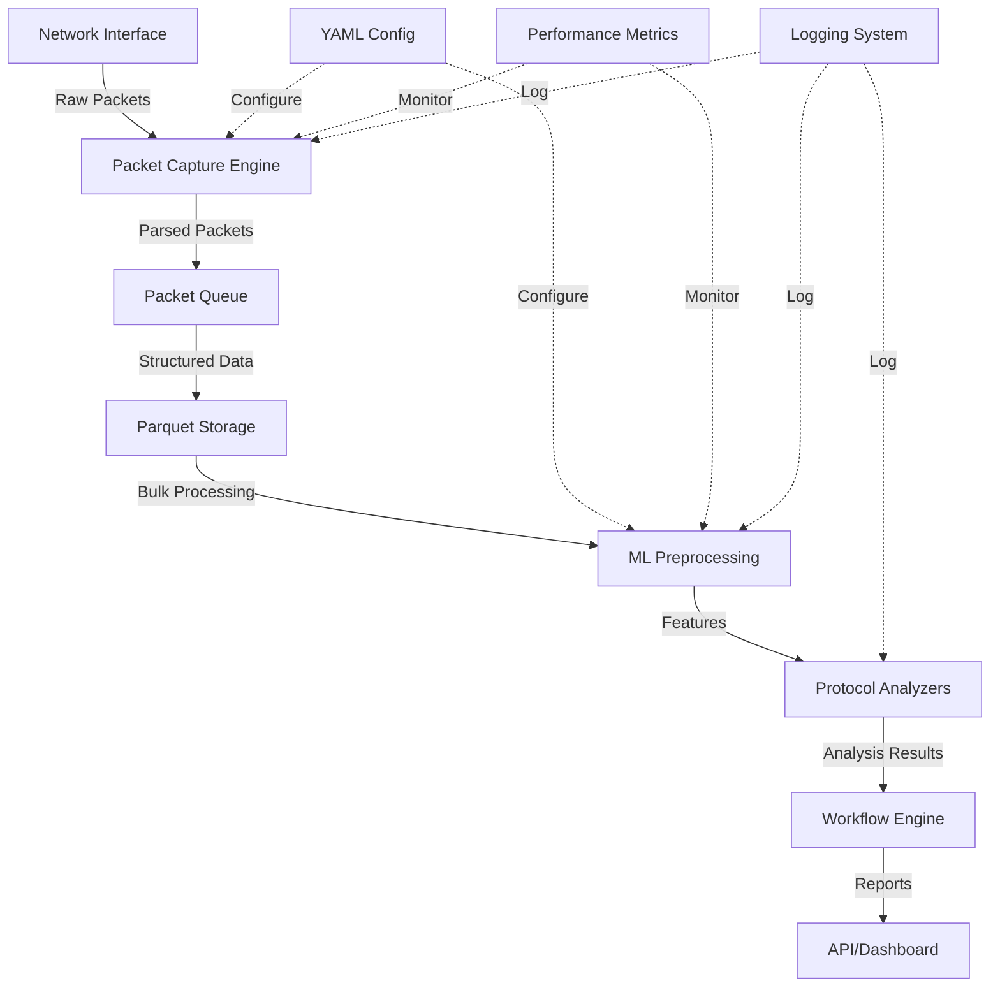
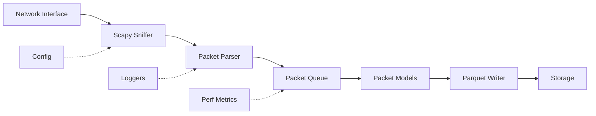
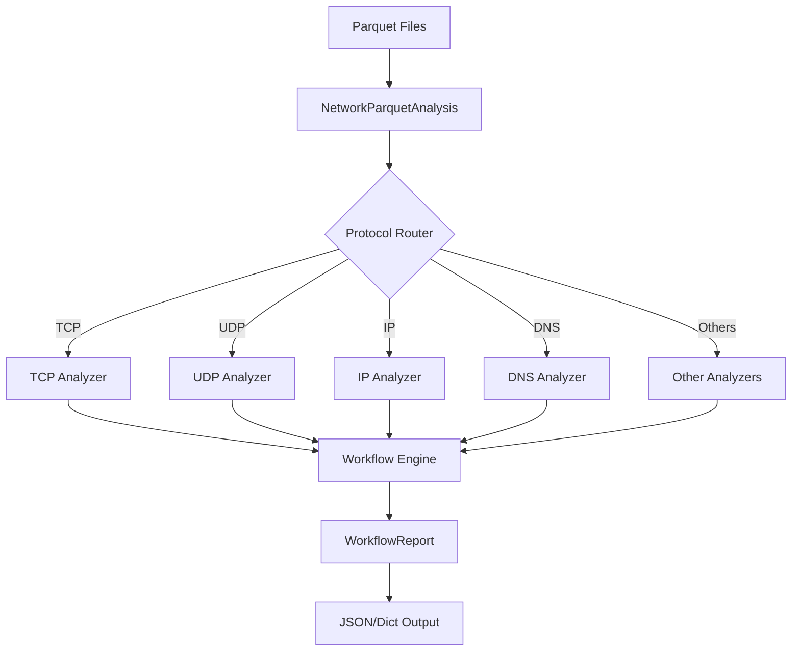
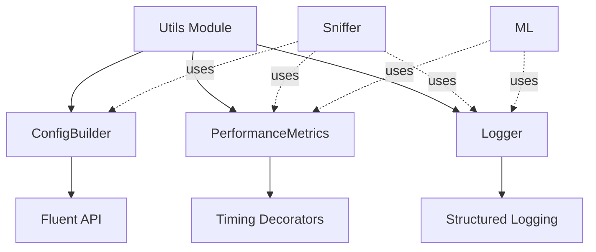
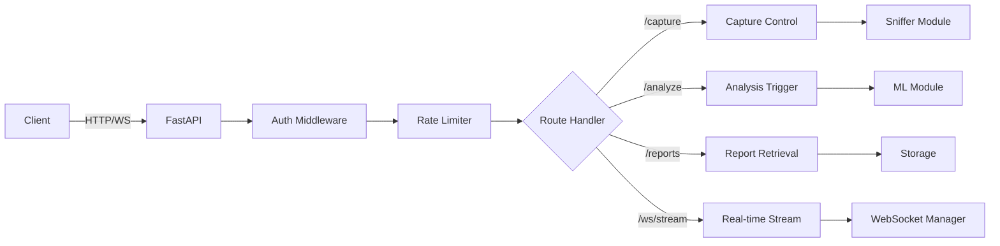
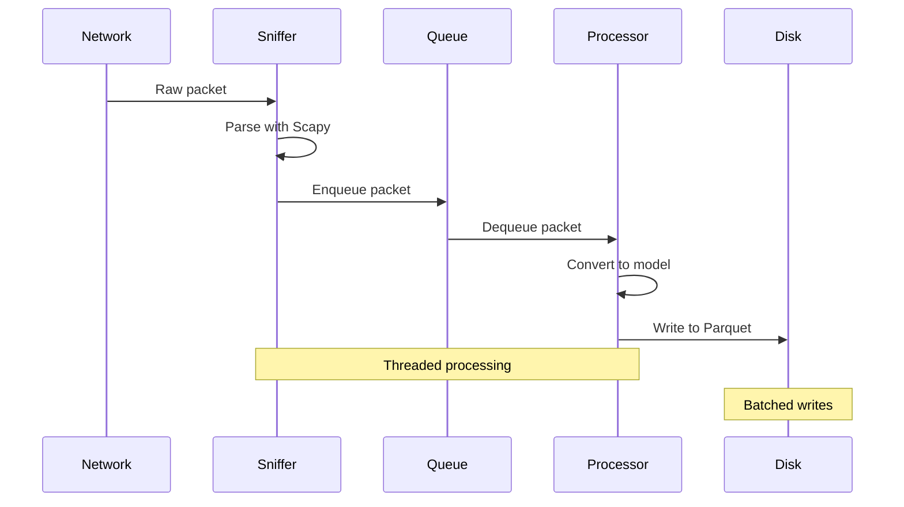
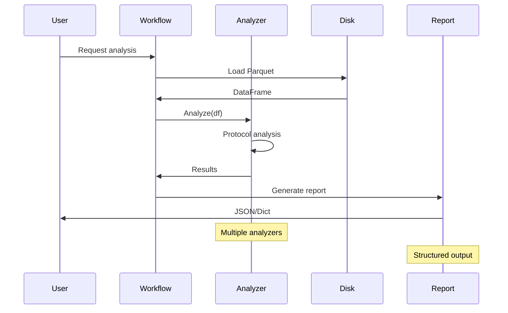
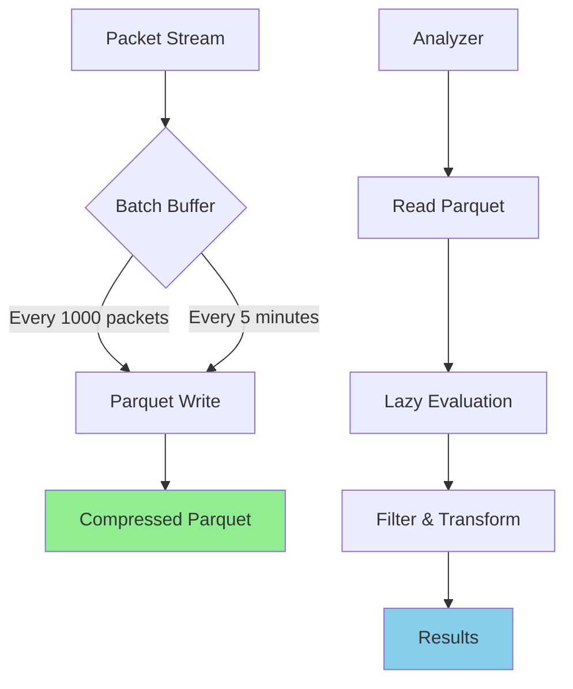
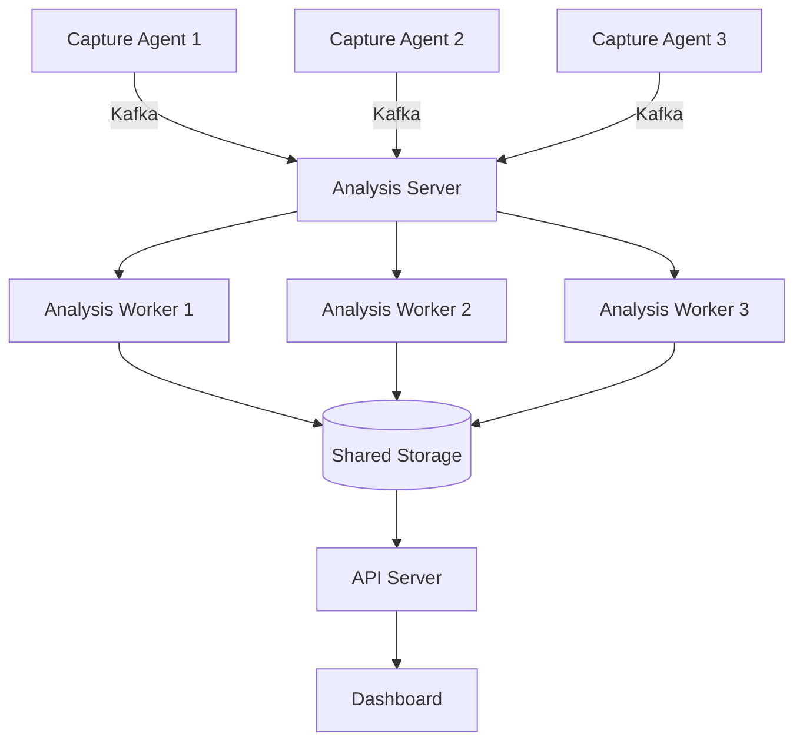
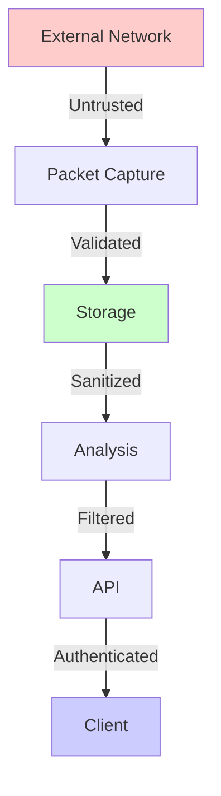

# Architecture Overview

This document provides a high-level overview of the NetGuard system architecture, design patterns, and key architectural decisions.

## System Architecture



## Module Architecture

### 1. Sniffer Module

**Purpose**: Real-time packet capture and initial processing



**Key Components**:
- `PacketCapture`: Main capture engine with threading
- `ParquetProcessor`: Efficient columnar storage
- `SnifferConfig`: Configuration management
- `Packet/PacketLayer`: Data models

**Design Patterns**:
- **Producer-Consumer**: Packet queue with threads
- **Builder**: Configuration construction
- **Strategy**: Different capture strategies
- **Observer**: Multi-logger system

### 2. ML Preprocessing Module

**Purpose**: Feature extraction and protocol analysis



**Protocol Analyzers**:

| Analyzer | Size | Complexity | Purpose |
|----------|------|------------|---------|
| TCP | 26KB | High | Connection tracking, flags, attacks |
| UDP | 25KB | Medium | Stateless analysis, port scanning |
| IP | 20KB | Medium | Routing, fragmentation, geolocation |
| Flow | 12KB | High | Traffic patterns, sessions |
| Anomaly | 11KB | High | Statistical anomaly detection |
| DNS | 9KB | Medium | Query analysis, tunneling |
| ICMP | 8KB | Low | Ping, traceroute, attacks |
| ARP | 7KB | Low | Address resolution, spoofing |

**Design Patterns**:
- **Strategy**: Different analyzer implementations
- **Template Method**: Base analyzer pattern
- **Factory**: Analyzer selection
- **Facade**: Workflow simplification

### 3. Models Module

**Purpose**: Data structures and validation

```python
# Data Flow
Raw Packet (bytes)
    ↓
Scapy Packet (scapy.Packet)
    ↓
Packet Model (Pydantic)
    ↓
DataFrame Row (Polars/Pandas)
    ↓
Parquet File (storage)
```

**Key Models**:
- `Packet`: Main packet representation
- `PacketLayer`: Protocol layer abstraction
- Database schemas for persistence

**Design Patterns**:
- **Data Transfer Object (DTO)**: Packet models
- **Value Object**: Immutable packet layers
- **Validation**: Pydantic validators

### 4. Utils Module

**Purpose**: Shared utilities and cross-cutting concerns



**Design Patterns**:
- **Builder**: Fluent configuration API
- **Decorator**: Performance timing
- **Singleton**: Logger instances
- **Adapter**: Logging abstraction

### 5. API Module (Planned)

**Purpose**: External access and integration



**Planned Features**:
- RESTful endpoints
- WebSocket for real-time data
- OAuth2/JWT authentication
- Rate limiting
- API documentation (OpenAPI)

## Data Flow

### Capture Flow



### Analysis Flow



## Design Principles

### 1. Separation of Concerns

Each module has a clear, single responsibility:
- **Sniffer**: Capture and store
- **ML**: Analyze and extract features
- **Models**: Define data structures
- **Utils**: Provide shared functionality
- **API**: External interface

### 2. Dependency Inversion

High-level modules depend on abstractions:
```python
# Good: Depends on interface
class PacketCapture:
    def __init__(self, config: ConfigInterface):
        self.config = config

# Bad: Depends on concrete class
class PacketCapture:
    def __init__(self, yaml_file: str):
        self.config = YAMLConfig(yaml_file)
```

### 3. Open/Closed Principle

Extensible without modification:
```python
# Add new analyzer without modifying existing code
class CustomAnalyzer(BaseAnalyzer):
    def analyze(self, df: pl.DataFrame) -> dict:
        # Custom implementation
        pass
```

### 4. Performance First

- Use Polars over Pandas for large datasets
- Parquet for efficient storage and columnar access
- Thread-safe queues for concurrent processing
- Memory-bounded deques to prevent OOM

### 5. Configuration Over Code

- YAML files for all settings
- Pydantic validation
- Environment variables support
- No hard-coded values

## Threading Model

### Packet Capture Threading

```python
# Main Thread: Packet capture
Thread 1: sniff(iface, prn=callback)
    ↓
# Worker Thread: Packet processing
Thread 2: process_queue()
    ↓ (queue)
# Background Thread: Periodic flush
Thread 3: flush_to_disk()
```

**Thread Safety**:
- `Queue`: Thread-safe packet queue
- `Lock`: Protects shared state
- `deque`: Atomic operations
- No shared mutable state

### Analysis Threading

ML preprocessing is currently single-threaded but designed for parallelization:

```python
# Future: Parallel analysis
with ProcessPoolExecutor() as executor:
    futures = [
        executor.submit(analyze_tcp, df),
        executor.submit(analyze_udp, df),
        executor.submit(analyze_dns, df),
    ]
```

## Storage Architecture

### Parquet Format

**Advantages**:
- Columnar storage (fast analytics queries)
- Excellent compression (10x smaller than CSV)
- Schema evolution support
- Fast column selection

**Schema**:
```
packet_capture.parquet
├── timestamp: datetime
├── src_ip: str
├── dst_ip: str
├── src_port: int16
├── dst_port: int16
├── protocol: str
├── length: int32
├── flags: str
└── raw_data: binary
```

### Storage Patterns



## Configuration Architecture

### Hierarchical Configuration

```yaml
# System-level
system:
  log_level: INFO
  workers: 4

# Module-level
sniffer:
  interface: eth0
  buffer_size: 1000

ml:
  chunk_size: 100000
  parallel: true

# Feature-level
analyzers:
  tcp:
    track_connections: true
    detect_scans: true
```

### Configuration Loading

```python
# Priority order (highest to lowest)
1. CLI arguments
2. Environment variables (NETGUARD_*)
3. Config file (--config)
4. Defaults in code
```

## Error Handling Architecture

### Error Hierarchy

```python
NetGuardError (base)
├── SnifferError
│   ├── InterfaceError
│   ├── CaptureError
│   └── DataConversionError
├── MLError
│   ├── AnalyzerError
│   ├── WorkflowError
│   └── PreprocessingError
├── ConfigError
│   └── ValidationError
└── StorageError
    ├── ParquetError
    └── FileSystemError
```

### Error Handling Strategy

```python
# Fail fast for configuration
if not config.is_valid():
    raise ConfigError("Invalid configuration")

# Graceful degradation for analysis
try:
    result = analyzer.analyze(df)
except AnalyzerError as e:
    logger.warning(f"Analyzer failed: {e}")
    result = None  # Continue with other analyzers

# Retry for transient failures
@retry(max_attempts=3, backoff=exponential)
def write_parquet(df, path):
    df.write_parquet(path)
```

## Performance Characteristics

### Packet Capture

- **Throughput**: ~10,000 packets/sec (depends on hardware)
- **Memory**: ~100MB for 10k packet buffer
- **Latency**: <1ms packet processing
- **Storage**: ~1GB/hour at 1000 pkt/sec

### ML Analysis

- **Batch Size**: 100k rows optimal
- **Processing Speed**: ~500k rows/sec (Polars)
- **Memory**: ~2GB for 1M packet analysis
- **Parallelization**: Linear scaling up to CPU cores

## Scalability Considerations

### Vertical Scaling

Current architecture supports:
- ✅ Multi-core processing (threading)
- ✅ Large memory datasets (Polars lazy)
- ✅ Fast storage (Parquet compression)

### Horizontal Scaling (Future)

Planned distributed architecture:


## Security Architecture

### Defense in Depth

1. **Input Validation**: Pydantic models
2. **Type Safety**: MyPy strict mode
3. **Dependency Scanning**: Bandit, pre-commit
4. **Least Privilege**: Capability-based capture
5. **Data Encryption**: Planned for storage
6. **API Authentication**: Planned OAuth2/JWT

### Security Boundaries



## Future Architecture

### Roadmap Components

1. **Distributed Capture**:
   - Multiple capture agents
   - Message queue (Kafka/RabbitMQ)
   - Central coordinator

2. **Real-time Pipeline**:
   - Stream processing (Flink/Spark)
   - In-memory analytics (Redis)
   - WebSocket feeds

3. **ML Integration**:
   - Model training pipeline
   - Online learning
   - Model registry (MLflow)

4. **Monitoring**:
   - Prometheus metrics
   - Grafana dashboards
   - Alert manager

## Conclusion

NetGuard follows **clean architecture principles** with:
- Clear module boundaries
- Dependency inversion
- Testable components
- Performance-first design
- Extensibility without modification

The architecture supports both **current requirements** (single-node capture and analysis) and **future scaling** (distributed, real-time, ML-powered).
