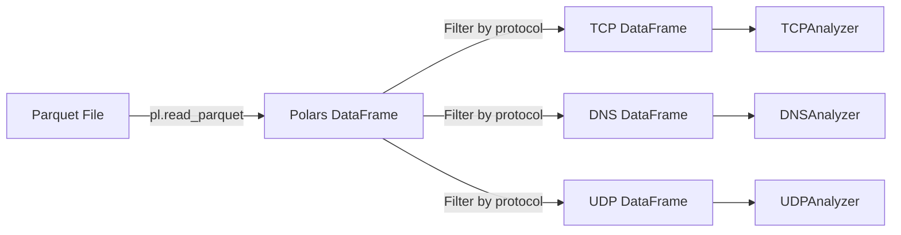
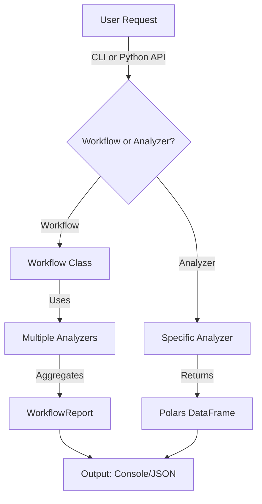
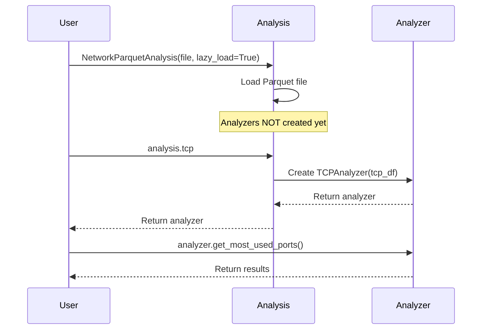

# Architecture

This document explains the design and architecture of the ML Network Analysis Module.

## Overview

The module follows a **layered architecture** with clear separation of concerns:

```
┌─────────────────────────────────────────────────────┐
│              High-Level Workflows                   │
│    (DailyAudit, IPInvestigation, ThreatHunting)     │
└────────────────┬────────────────────────────────────┘
                 │
┌────────────────┴────────────────────────────────────┐
│         NetworkParquetAnalysis (Core)               │
│      (Base class, data loading, basic queries)      │
└────────────────┬────────────────────────────────────┘
                 │
┌────────────────┴────────────────────────────────────┐
│              Specialized Analyzers                  │
│  TCP │ UDP │ DNS │ IP │ Flow │ ARP │ ICMP │ Anomaly │
└────────────────┬────────────────────────────────────┘
                 │
┌────────────────┴────────────────────────────────────┐
│           Data Layer (Polars DataFrames)            │
│             (Parquet files, efficient queries)      │
└─────────────────────────────────────────────────────┘
```

## Design Principles

### 1. Modularity

Each analyzer is **independent** and focuses on a single protocol or analysis type:

```python
# Each analyzer has a single responsibility
tcp_analyzer = TCPAnalyzer(df)
dns_analyzer = DNSAnalyzer(df)
```

### 2. Composition Over Inheritance

The base `NetworkParquetAnalysis` class **composes** analyzers rather than inheriting from them:

```python
class NetworkParquetAnalysis:
    def __init__(self, parquet_file):
        self.df = pl.read_parquet(parquet_file)

        # Composition: create analyzer instances
        self.tcp = TCPAnalyzer(self.df.filter(pl.col("protocol") == "TCP"))
        self.dns = DNSAnalyzer(self.df.filter(pl.col("protocol") == "DNS"))
        # ... etc
```

### 3. Lazy Evaluation

Analyzers can be initialized lazily to save memory:

```python
# Only create analyzers when accessed
analysis = NetworkParquetAnalysis("large.parquet", lazy_load=True)

# TCP analyzer created on first access
tcp_stats = analysis.tcp.get_most_used_ports(n=10)
```

### 4. Polars-First

All data operations use **Polars** for performance:

- Lazy evaluation support
- Efficient columnar operations
- Native Parquet support
- Fast aggregations and groupby

```python
# Polars DataFrame operations are fast and expressive
result = df.group_by("source_ip").agg([
    pl.count().alias("packet_count"),
    pl.sum("bytes").alias("total_bytes")
]).sort("packet_count", descending=True)
```

## Core Components

### NetworkParquetAnalysis (Base Class)

**Responsibilities:**

- Load Parquet files
- Provide basic queries (filter by protocol, IP, timestamp)
- Initialize and manage analyzers
- Generate summary reports

**Key Methods:**

```python
class NetworkParquetAnalysis:
    def __init__(self, parquet_file, lazy_load=False)
    def get_by_protocol(self, protocol: str)
    def find_ip_information(self, ip_address: str)
    def get_timestamps(self)
    def get_packet_count(self)
    def generate_network_summary(self)
```

**File**: `preprocessing/parquet_analysis.py`

### Analyzers

Each analyzer inherits from a base class and implements protocol-specific analysis.

#### Base Analyzer Pattern

```python
class BaseAnalyzer:
    def __init__(self, df: pl.DataFrame):
        self.df = df
        self.logger = get_logger()

    def _validate_dataframe(self):
        """Ensure required columns exist"""
        required = self._get_required_columns()
        missing = [col for col in required if col not in self.df.columns]
        if missing:
            raise MissingColumnError(f"Missing columns: {missing}")
```

#### Specialized Analyzers

| Analyzer | Inherits From | Data Source | Key Methods |
|----------|---------------|-------------|-------------|
| TCPAnalyzer | BaseAnalyzer | TCP packets | Connection analysis, flag distribution |
| UDPAnalyzer | BaseAnalyzer | UDP packets | Flow stats, flood detection |
| DNSAnalyzer | BaseAnalyzer | DNS packets | Query analysis, tunneling detection |
| IPAnalyzer | BaseAnalyzer | All packets | Top talkers, hub detection |
| FlowAnalyzer | BaseAnalyzer | All packets | Flow creation, beaconing |
| ARPAnalyzer | BaseAnalyzer | ARP packets | Spoofing detection |
| ICMPAnalyzer | BaseAnalyzer | ICMP packets | Ping analysis, tunneling |
| AnomalyAnalyzer | BaseAnalyzer | All packets | Cross-protocol attack detection |

**Files**: `preprocessing/analyzers/`

### Workflows

High-level workflows simplify common tasks by orchestrating multiple analyzers.

```python
class DailyAudit:
    def __init__(self, parquet_file):
        self.analysis = NetworkParquetAnalysis(parquet_file)

    def run(self):
        report = WorkflowReport("Daily Audit")

        # Orchestrate multiple analyzers
        self._check_port_scans(report)       # Uses anomaly analyzer
        self._check_dns_threats(report)      # Uses DNS analyzer
        self._check_top_talkers(report)      # Uses IP analyzer

        return report
```

**Advantages:**

- Simplifies 90% of use cases
- Consistent report format
- Easy to extend with new checks

**Files**: `preprocessing/workflows.py`

## Data Flow

### 1. Loading Data



### 2. Analysis Pipeline



### 3. Lazy Loading



## Design Patterns

### 1. Strategy Pattern (Analyzers)

Each analyzer implements a different strategy for analyzing the same data:

```python
# Different strategies for analysis
tcp_strategy = TCPAnalyzer(df)
dns_strategy = DNSAnalyzer(df)

# Use interchangeably
analyzers = [tcp_strategy, dns_strategy]
for analyzer in analyzers:
    analyzer.run_analysis()
```

### 2. Facade Pattern (Workflows)

Workflows provide a simplified interface to complex analyzer interactions:

```python
# Complex: Use multiple analyzers manually
tcp = analysis.tcp
dns = analysis.dns
anomaly = analysis.anomaly

tcp_issues = tcp.detect_incomplete_connections()
dns_issues = dns.detect_dns_tunneling()
port_scans = anomaly.detect_port_scanning()

# Simple: Use workflow facade
audit = DailyAudit("capture.parquet")
report = audit.run()  # Handles all the above automatically
```

### 3. Template Method Pattern (Base Analyzer)

Base analyzer defines the analysis template, subclasses fill in details:

```python
class BaseAnalyzer:
    def run_analysis(self):
        self._validate_dataframe()  # Template method
        self._preprocess()           # Template method
        results = self._analyze()    # Template method (subclass implements)
        self._postprocess(results)   # Template method
        return results

class TCPAnalyzer(BaseAnalyzer):
    def _analyze(self):
        # Subclass-specific implementation
        return self.df.group_by("flags").count()
```

## Error Handling

### Custom Exceptions

```python
class ParquetAnalysisError(Exception):
    """Base exception for analysis errors"""

class MissingColumnError(ParquetAnalysisError):
    """Raised when required columns are missing"""

class InvalidProtocolError(ParquetAnalysisError):
    """Raised when protocol is not recognized"""
```

**File**: `preprocessing/errors.py`

### Error Handling Strategy

```python
try:
    analysis = NetworkParquetAnalysis("capture.parquet")
    report = DailyAudit(analysis).run()
except MissingColumnError as e:
    logger.error(f"Data format issue: {e}")
except ParquetAnalysisError as e:
    logger.error(f"Analysis failed: {e}")
except Exception as e:
    logger.error(f"Unexpected error: {e}")
```

## Performance Considerations

### 1. Memory Efficiency

- **Lazy loading**: Only create analyzers when needed
- **Lazy evaluation**: Use `pl.scan_parquet()` for very large files
- **Column selection**: Read only required columns

```python
# Memory efficient: Only load needed columns
df = pl.scan_parquet("large.parquet").select([
    "timestamp", "source_ip", "destination_ip", "protocol"
]).collect()
```

### 2. Computation Efficiency

- **Polars operations**: Vectorized, parallel by default
- **Caching**: Memoize expensive computations
- **Early filtering**: Filter data as early as possible

```python
# Efficient: Filter before analysis
tcp_df = df.filter(pl.col("protocol") == "TCP")
tcp_analyzer = TCPAnalyzer(tcp_df)  # Works with smaller dataset
```

### 3. Scalability

For very large datasets (>10M packets):

1. **Chunked processing**: Process in batches
2. **Streaming**: Use lazy evaluation
3. **Sampling**: Analyze representative sample first
4. **Distributed**: Use Dask or Ray (future)

## Extension Points

### Adding a New Analyzer

```python
# 1. Create analyzer class
class HTTPAnalyzer(BaseAnalyzer):
    def _get_required_columns(self):
        return ["http_method", "http_status", "url"]

    def get_top_urls(self, n=10):
        return self.df.group_by("url").count().head(n)

# 2. Add to NetworkParquetAnalysis
class NetworkParquetAnalysis:
    def __init__(self, parquet_file):
        # ... existing code ...
        self.http = HTTPAnalyzer(self.get_by_protocol("HTTP"))
```

### Adding a New Workflow

```python
# 1. Create workflow class
class ComplianceAudit:
    def __init__(self, parquet_file):
        self.analysis = NetworkParquetAnalysis(parquet_file)

    def run(self):
        report = WorkflowReport("Compliance Audit")
        # Add compliance checks
        return report

# 2. Add to CLI
parser.add_subparsers().add_parser("compliance-audit")
```

## Testing Strategy

### Unit Tests

Test each analyzer independently:

```python
def test_tcp_analyzer_flag_distribution():
    # Create test data
    df = create_test_tcp_dataframe()

    # Test analyzer
    analyzer = TCPAnalyzer(df)
    result = analyzer.get_flag_distribution()

    # Assert expected behavior
    assert "SYN" in result["flag"].to_list()
```

### Integration Tests

Test workflows end-to-end:

```python
def test_daily_audit_workflow():
    # Use real capture file
    audit = DailyAudit("tests/fixtures/sample_capture.parquet")
    report = audit.run()

    # Verify report structure
    assert isinstance(report, WorkflowReport)
    assert len(report.findings) >= 0
```

**Files**: `tests/ml/preprocessing/`

## Future Architecture

Planned enhancements:

1. **Plugin System**: Dynamic analyzer loading
2. **ML Integration**: Native model training/inference
3. **Real-time Processing**: Stream processing support
4. **Distributed Analysis**: Spark/Dask integration
5. **REST API**: HTTP API for remote analysis

## Code Organization

```
ml/preprocessing/
├── parquet_analysis.py      # Core base class
├── workflows.py             # High-level workflows
├── analyzers/               # Protocol analyzers
│   ├── tcp_analyzer.py
│   ├── dns_analyzer.py
│   └── ...
├── logger.py                # Logging utilities
├── errors.py                # Custom exceptions
├── utils.py                 # Helper functions
├── main.py                  # CLI entry point
└── examples/                # Usage examples
```

## Dependencies

- **polars**: Fast DataFrame operations
- **pyarrow**: Parquet file support
- **Python 3.10+**: For modern type hints and features

Minimal dependencies by design for easier maintenance.
