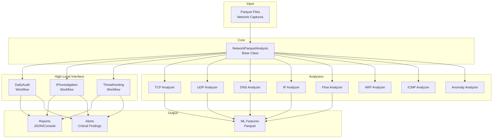

# ML Network Analysis Module

Welcome to the **ML Network Analysis Module** documentation. This module provides comprehensive tools for analyzing network traffic, detecting security threats, and extracting features for machine learning models.

## What Does This Module Do?

The ML Network Analysis Module analyzes network packet captures (stored in Parquet format) to:

- **Detect Security Threats**: Port scans, SYN floods, DNS tunneling, data exfiltration, and more
- **Analyze Traffic Patterns**: Flow analysis, behavioral profiling, and anomaly detection
- **Extract ML Features**: Generate training data for machine learning models
- **Investigate Incidents**: Deep dive into specific IPs or time windows
- **Generate Reports**: Automated security audit reports with severity ratings

## Key Features

### 🎯 High-Level Workflows

Three simple workflows cover 90% of use cases:

- **[Daily Security Audit](user-guide/workflows/daily-audit.md)**: Automated security checks with color-coded reports
- **[IP Investigation](user-guide/workflows/ip-investigation.md)**: Deep dive into specific IP behavior
- **[Threat Hunting](user-guide/workflows/threat-hunting.md)**: Proactive hunting for C2, data theft, and lateral movement

### 🔬 8 Specialized Analyzers

Each analyzer is an expert in a specific protocol or analysis type:

| Analyzer | Purpose | Key Features |
|----------|---------|--------------|
| **[TCP](analyzers/tcp.md)** | TCP traffic analysis | Connection tracking, flag analysis, retransmissions |
| **[UDP](analyzers/udp.md)** | UDP traffic analysis | Flow stats, flood detection, amplification attacks |
| **[DNS](analyzers/dns.md)** | DNS analysis | Tunneling detection, DGA identification, query analysis |
| **[IP](analyzers/ip.md)** | IP-level analysis | Top talkers, hub detection, fragmentation analysis |
| **[Flow](analyzers/flow.md)** | Flow-based analysis | 5-tuple flows, beaconing detection, long-lived connections |
| **[ARP](analyzers/arp.md)** | ARP traffic analysis | Spoofing detection, ARP table reconstruction |
| **[ICMP](analyzers/icmp.md)** | ICMP analysis | Ping analysis, tunneling detection, flood detection |
| **[Anomaly](analyzers/anomaly.md)** | Cross-protocol threats | Port/host scanning, attacks, behavioral anomalies |

### 📊 Comprehensive Analysis

- **15+ Attack Detection Methods**: Port scans, floods, tunneling, spoofing, and more
- **Behavioral Analysis**: Traffic profiling for ML feature extraction
- **Protocol Deep-Dive**: Protocol-specific analysis with 200+ methods
- **Flexible Reporting**: JSON, CSV, Parquet exports

## Quick Example

=== "Daily Audit (CLI)"

    ```bash
    # Run automated security audit
    uv run python -m preprocessing.main daily-audit capture.parquet
    ```

=== "Daily Audit (Python)"

    ```python
    from network_security_suite.ml.preprocessing.workflows import DailyAudit

    # Run audit
    audit = DailyAudit("capture.parquet")
    report = audit.run()

    # Show results
    print(report.summary())

    # Check severity
    if report.severity_counts["critical"] > 0:
        send_alert("Critical findings detected!")
    ```

=== "IP Investigation"

    ```python
    from network_security_suite.ml.preprocessing.workflows import IPInvestigation

    # Investigate suspicious IP
    inv = IPInvestigation("capture.parquet", ip="192.168.1.100")
    report = inv.run()

    print(report.summary())
    ```

=== "Low-Level Analysis"

    ```python
    from network_security_suite.ml.preprocessing.parquet_analysis import NetworkParquetAnalysis

    # Load data
    analysis = NetworkParquetAnalysis("capture.parquet")

    # Protocol-specific analysis
    top_ports = analysis.tcp.get_most_used_ports(n=10)
    dns_tunneling = analysis.dns.detect_dns_tunneling(length_threshold=100)
    port_scans = analysis.anomaly.detect_port_scanning(threshold=100, time_window="1m")

    # IP analysis
    top_ips = analysis.ip.get_most_active_ips(n=10, by="bytes")
    hubs = analysis.ip.detect_hub_ips(threshold=50)
    ```

## Architecture



## Getting Started

1. **[Installation](installation.md)**: Set up the module
2. **[Quick Start](quickstart.md)**: Run your first analysis in 5 minutes
3. **[Workflows Guide](user-guide/workflows/index.md)**: Learn the three main workflows
4. **[CLI Reference](user-guide/cli-reference.md)**: Command-line interface documentation

## Use Cases

### Security Operations

- **Daily Monitoring**: Automated security audits with alert integration
- **Incident Response**: Investigate suspicious IPs and behaviors
- **Threat Hunting**: Proactively search for advanced threats
- **Compliance**: Generate audit reports and evidence

### Machine Learning

- **Feature Engineering**: Extract behavioral features from network traffic
- **Training Data**: Generate labeled datasets for ML models
- **Anomaly Detection**: Feed data to ML-based anomaly detectors
- **Behavioral Profiling**: Create baseline profiles for normal behavior

### Network Analysis

- **Performance Monitoring**: Identify bandwidth hogs and bottlenecks
- **Protocol Analysis**: Understand traffic composition
- **Connection Tracking**: Monitor TCP connection states
- **DNS Analysis**: Track DNS queries and responses

## Project Status

!!! info "Current Status"
    - ✅ **8 Analyzers**: All completed and tested
    - ✅ **3 Workflows**: Daily Audit, IP Investigation, Threat Hunting
    - ✅ **CLI Interface**: Full command-line support
    - 🚧 **Testing**: Unit tests in progress
    - 📝 **Documentation**: This documentation site

See [Changelog](development/changelog.md) for recent updates.

## Support

- **Issues**: Report bugs or request features on GitHub
- **Discussions**: Ask questions and share ideas
- **Contributing**: See [Contributing Guide](development/contributing.md)

## License

[Add your license information here]
