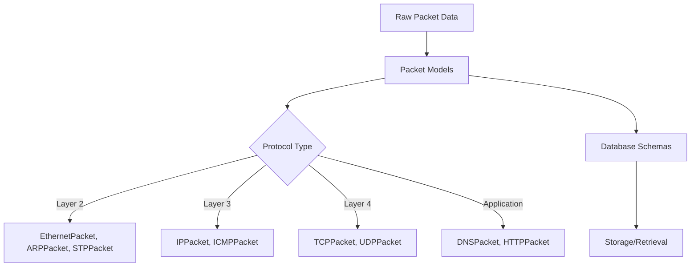

# Models Module

The Models module provides data structures and database schemas for packet and network data representation throughout the Network Security Suite.

## Overview

This module contains Pydantic-based data models that ensure type safety and validation for all network data. It provides structured representations of network packets, protocols, and database schemas.

## Key Features

- **Type-Safe Data Structures**: Pydantic models with full type validation
- **Protocol Support**: Models for various network protocols (ARP, STP, Ethernet, IP, TCP, UDP, etc.)
- **Database Integration**: SQLAlchemy-compatible schemas
- **Serialization**: Easy JSON/dict conversion
- **Validation**: Automatic data validation and error handling

## Components

### Packet Data Structures

The packet data structures module provides Pydantic models for different network protocols:

- **EthernetPacket**: Ethernet frame representation
- **ARPPacket**: ARP protocol packets
- **STPPacket**: Spanning Tree Protocol packets
- **IPPacket**: IP layer packets
- **TCPPacket**: TCP protocol packets
- **UDPPacket**: UDP protocol packets
- **ICMPPacket**: ICMP protocol packets
- **DNSPacket**: DNS protocol packets

See [Packet Data Structures API](api/packet-data-structures.md) for details.

### Database Schemas

Database schema definitions for storing network data:

- **PacketRecord**: Base packet record schema
- **FlowRecord**: Network flow record schema
- **AlertRecord**: Security alert schema

See [Database Schemas API](api/database-schemas.md) for details.

## Quick Start

### Using Packet Models

```python
from network_security_suite.models import ARPPacket, EthernetPacket

# Create an ARP packet
arp_packet = ARPPacket(
    operation=1,  # ARP Request
    sender_mac="00:11:22:33:44:55",
    sender_ip="192.168.1.100",
    target_mac="00:00:00:00:00:00",
    target_ip="192.168.1.1"
)

# Access fields
print(f"Sender: {arp_packet.sender_ip}")
print(f"Target: {arp_packet.target_ip}")

# Serialize to dict
arp_dict = arp_packet.model_dump()

# Serialize to JSON
arp_json = arp_packet.model_dump_json()
```

### Creating from Raw Data

```python
from network_security_suite.models import TCPPacket

# Create from dictionary
tcp_data = {
    "src_port": 443,
    "dst_port": 54321,
    "seq": 1000,
    "ack": 2000,
    "flags": "SA",
    "window": 65535
}

tcp_packet = TCPPacket(**tcp_data)
```

### Validation

Models automatically validate data:

```python
from network_security_suite.models import IPPacket
from pydantic import ValidationError

try:
    # Invalid IP address
    ip_packet = IPPacket(
        src_ip="999.999.999.999",
        dst_ip="192.168.1.1"
    )
except ValidationError as e:
    print(f"Validation error: {e}")
```

## Architecture



## Use Cases

### Data Validation

Ensure all network data conforms to expected schemas:

```python
from network_security_suite.models import TCPPacket

def process_tcp_packet(packet_data):
    try:
        packet = TCPPacket(**packet_data)
        # Process validated packet
        return packet
    except ValidationError as e:
        # Handle invalid data
        log_error(f"Invalid packet: {e}")
        return None
```

### Database Storage

Store packets in database with proper schemas:

```python
from network_security_suite.models import PacketRecord
from sqlalchemy.orm import Session

def save_packet(session: Session, packet: EthernetPacket):
    record = PacketRecord(
        timestamp=packet.timestamp,
        src_mac=packet.src_mac,
        dst_mac=packet.dst_mac,
        protocol=packet.protocol
    )
    session.add(record)
    session.commit()
```

### API Serialization

Easy serialization for API responses:

```python
from network_security_suite.models import ARPPacket

arp_packet = ARPPacket(...)

# Convert to JSON for API response
return arp_packet.model_dump_json()
```

## Model Hierarchy

### Base Models

All packet models inherit from base classes:

```python
NetworkPacket (Base)
├── Layer2Packet
│   ├── EthernetPacket
│   ├── ARPPacket
│   └── STPPacket
├── Layer3Packet
│   ├── IPPacket
│   └── ICMPPacket
└── Layer4Packet
    ├── TCPPacket
    └── UDPPacket
```

## Best Practices

### 1. Always Validate Input

```python
def process_packet(raw_data: dict):
    try:
        packet = EthernetPacket(**raw_data)
        # Process packet
    except ValidationError:
        # Handle invalid data
        pass
```

### 2. Use Type Hints

```python
from network_security_suite.models import TCPPacket

def analyze_tcp(packet: TCPPacket) -> dict:
    """Type hints ensure correct usage"""
    return {
        "syn": "S" in packet.flags,
        "ack": "A" in packet.flags
    }
```

### 3. Leverage Pydantic Features

```python
from network_security_suite.models import IPPacket

# Use validators
packet = IPPacket(
    src_ip="192.168.1.1",
    dst_ip="10.0.0.1"
)

# Access validated data
print(packet.model_dump())
```

## Performance Considerations

- **Validation Overhead**: Pydantic validation has minimal overhead
- **Serialization**: Use `model_dump()` for dicts, `model_dump_json()` for JSON
- **Memory**: Models are lightweight and memory-efficient
- **Caching**: Consider caching validated models for frequently used data

## Next Steps

- [Getting Started Guide](getting-started.md): Step-by-step tutorial
- [Data Structures Guide](data-structures.md): Detailed model documentation
- [API Reference](api/packet-data-structures.md): Complete API documentation
