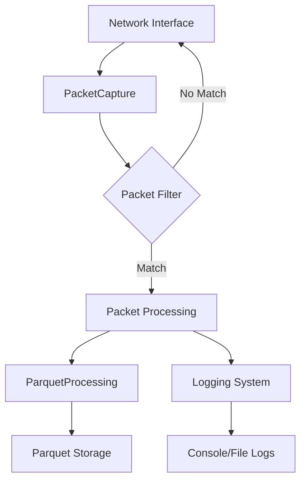

# Sniffer Module

The Sniffer module is the core network packet capture and processing engine of the Network Security Suite. It provides real-time packet capture, filtering, and storage capabilities.

## Overview

The sniffer module uses low-level packet capture libraries to intercept network traffic and provides a high-level API for working with captured packets. It supports multiple network interfaces, customizable packet filtering, and efficient storage using Parquet format.

## Key Features

- **Real-time Packet Capture**: Capture network packets in real-time from one or multiple network interfaces
- **Advanced Filtering**: Apply BPF (Berkeley Packet Filter) filters to capture only relevant traffic
- **Efficient Storage**: Store captured packets in Parquet format for efficient analysis
- **Multi-interface Support**: Capture from multiple network interfaces simultaneously
- **Comprehensive Logging**: Specialized loggers for different types of events (security, packets, errors, etc.)
- **Protocol Support**: Support for various network protocols (Ethernet, ARP, IP, TCP, UDP, DNS, etc.)
- **Configuration Management**: YAML-based configuration for easy setup

## Components

### PacketCapture
The main class for capturing network packets. It handles:
- Interface selection and configuration
- Packet filtering
- Real-time packet processing
- Storage management

See [PacketCapture API Reference](api/packet-capture.md) for details.

### ParquetProcessing
Handles conversion of captured packets to Parquet format for efficient storage and analysis.

See [ParquetProcessing API Reference](api/parquet-processing.md) for details.

### Interfaces
Utilities for discovering and managing network interfaces.

See [Interfaces API Reference](api/interfaces.md) for details.

### Loggers
Specialized logger classes for different types of events:
- ConsoleLogger: Console output
- SecurityLogger: Security-related events
- PacketLogger: Packet information
- FileLogger: General file logging
- RotatingFileLogger: File logging with rotation
- ErrorLogger, DebugLogger, CriticalLogger, etc.

See [Loggers API Reference](api/loggers.md) for details.

### Exceptions
Custom exceptions for packet capture operations.

See [Exceptions API Reference](api/exceptions.md) for details.

### Configuration
YAML-based configuration system for sniffer settings.

See [Configuration API Reference](api/sniffer-config.md) for details.

## Quick Start

### Basic Packet Capture

```python
from network_security_suite.sniffer import PacketCapture

# Create a packet capture instance
capture = PacketCapture(
    interface="eth0",
    packet_count=1000,
    filter_str="tcp port 80"
)

# Start capturing
capture.start()

# Packets are automatically saved to Parquet files
```

### Using Configuration File

```python
from network_security_suite.sniffer.sniffer_config import SnifferConfig

# Load configuration from YAML
config = SnifferConfig.from_yaml("config.yaml")

# Create capture with configuration
capture = PacketCapture.from_config(config)
capture.start()
```

### Custom Logging

```python
from network_security_suite.sniffer import SecurityLogger, PacketLogger

# Set up specialized loggers
security_logger = SecurityLogger()
packet_logger = PacketLogger()

# Use in your packet capture
capture = PacketCapture(
    interface="eth0",
    security_logger=security_logger,
    packet_logger=packet_logger
)
```

## Use Cases

### Network Monitoring
Monitor network traffic for suspicious activity, unusual patterns, or security threats.

### Protocol Analysis
Analyze specific network protocols to understand traffic patterns and identify issues.

### Security Auditing
Capture and store network traffic for security auditing and compliance purposes.

### Performance Analysis
Monitor network performance metrics like bandwidth usage, latency, and packet loss.

## Architecture



## Performance Considerations

- **Buffer Size**: Adjust packet buffer size based on traffic volume
- **Filter Optimization**: Use efficient BPF filters to reduce processing overhead
- **Storage**: Parquet format provides excellent compression and query performance
- **Multi-threading**: Consider using multiple capture threads for high-traffic environments

## Next Steps

- [Getting Started Guide](getting-started.md): Step-by-step tutorial for setting up packet capture
- [Configuration Guide](configuration.md): Detailed configuration options
- [Packet Filtering Guide](packet-filtering.md): Advanced filtering techniques
- [API Reference](api/packet-capture.md): Complete API documentation
- [Examples](examples/basic-capture.md): Practical examples and use cases
