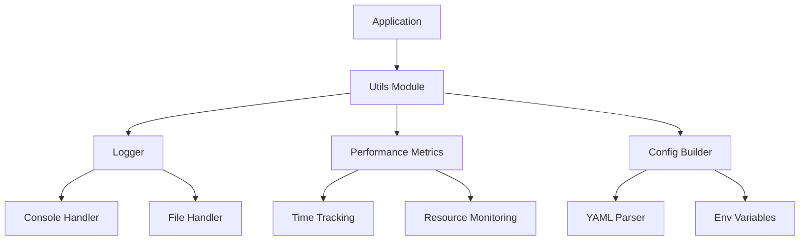

# Utils Module

The Utils module provides shared utilities and helper functions used across the Network Security Suite.

## Overview

This module contains common utilities for logging, performance monitoring, configuration management, and other cross-cutting concerns.

## Key Features

- **Advanced Logging**: Comprehensive logging system with multiple handlers and formatters
- **Performance Metrics**: Track and monitor application performance
- **Configuration Management**: Tools for managing application configuration
- **Reusable Utilities**: Common functions used throughout the suite

## Components

### Logger

Advanced logging system with support for:
- Multiple log levels (DEBUG, INFO, WARNING, ERROR, CRITICAL)
- Multiple handlers (console, file, rotating file)
- Custom formatters
- Colored console output
- Log aggregation

See [Logger API Reference](api/logger.md) for details.

### Performance Metrics

Performance monitoring and metrics collection:
- Execution time tracking
- Resource usage monitoring
- Custom metrics
- Performance profiling

See [Performance Metrics API Reference](api/performance-metrics.md) for details.

### Config Builder

Configuration management utilities:
- YAML configuration loading
- Environment variable support
- Configuration validation
- Default values

See [Config Builder API Reference](api/config-builder.md) for details.

## Quick Start

### Using the Logger

```python
from network_security_suite.utils import get_logger

# Get a logger instance
logger = get_logger(__name__)

# Log messages
logger.debug("Debug message")
logger.info("Information message")
logger.warning("Warning message")
logger.error("Error message")
logger.critical("Critical message")
```

### Performance Monitoring

```python
from network_security_suite.utils import PerformanceMetrics

# Track execution time
metrics = PerformanceMetrics()

with metrics.measure("operation"):
    # Your code here
    process_data()

# Get metrics
print(f"Operation took: {metrics.get_time('operation')}s")
```

### Configuration Management

```python
from network_security_suite.utils import ConfigBuilder

# Load configuration
config = ConfigBuilder.from_yaml("config.yaml")

# Access values
db_host = config.get("database.host", default="localhost")
db_port = config.get("database.port", default=5432)
```

## Use Cases

### Centralized Logging

Set up logging for the entire application:

```python
from network_security_suite.utils import setup_logging

# Configure logging
setup_logging(
    level="INFO",
    log_file="app.log",
    console=True,
    colored=True
)

# Use in your modules
logger = get_logger(__name__)
logger.info("Application started")
```

### Performance Profiling

Profile performance-critical sections:

```python
from network_security_suite.utils import PerformanceMetrics

metrics = PerformanceMetrics()

# Profile packet processing
with metrics.measure("packet_processing"):
    for packet in packets:
        process_packet(packet)

# Profile database operations
with metrics.measure("database_query"):
    results = db.query(...)

# Get report
report = metrics.get_report()
print(report)
```

### Configuration Management

Manage application configuration:

```python
from network_security_suite.utils import ConfigBuilder

# Load configuration with environment overrides
config = ConfigBuilder.from_yaml(
    "config.yaml",
    env_prefix="NETGUARD_"
)

# Access configuration
interface = config.get("sniffer.interface")
packet_count = config.get("sniffer.packet_count", default=1000)
```

## Architecture



## Best Practices

### 1. Use Structured Logging

```python
logger = get_logger(__name__)

# Good: Structured logging
logger.info("Packet captured", extra={
    "src_ip": "192.168.1.100",
    "dst_ip": "10.0.0.1",
    "protocol": "TCP"
})

# Less ideal: String formatting
logger.info(f"Packet from 192.168.1.100 to 10.0.0.1 (TCP)")
```

### 2. Use Context Managers for Metrics

```python
# Good: Automatic timing
with metrics.measure("operation"):
    do_work()

# Less ideal: Manual timing
start = time.time()
do_work()
metrics.record("operation", time.time() - start)
```

### 3. Centralize Configuration

```python
# config.yaml
app:
  name: "Network Security Suite"
  version: "1.0.0"

sniffer:
  interface: "eth0"
  packet_count: 1000

ml:
  model_path: "./models"
  threshold: 0.8

# Access anywhere
config = ConfigBuilder.from_yaml("config.yaml")
```

## Performance Considerations

- **Logging**: Use appropriate log levels in production
- **Metrics**: Be mindful of overhead when tracking many metrics
- **Configuration**: Load configuration once at startup
- **Caching**: Utilize caching for frequently accessed values

## Next Steps

- [Logging Guide](logging.md): Detailed logging documentation
- [Performance Metrics Guide](performance-metrics.md): Performance monitoring guide
- [Configuration Guide](configuration.md): Configuration management guide
- [API Reference](api/logger.md): Complete API documentation
